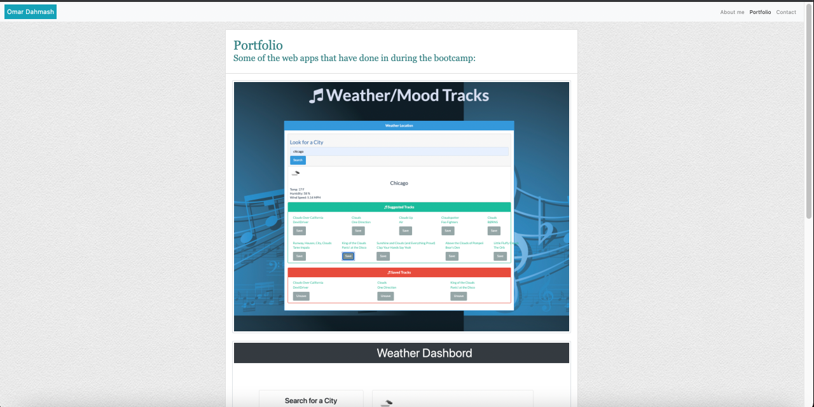
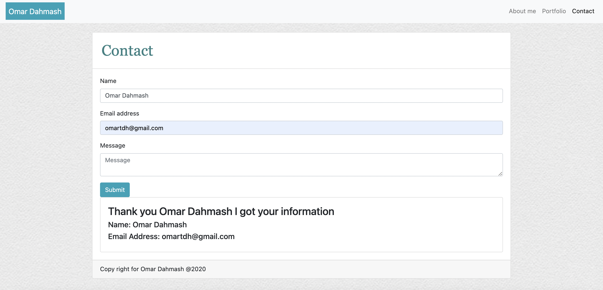

# aboutMe

This project is a simple website about me, just to practice bootstrap and get more familiar with it, 

## File 1:
* [`About Me`](index.html)

-using bootstrap created a navbar that is mobile accessible
-added an image as a background using CSS
-used a card class to write the bio about me, added a picture, and two paragraphs.
-used class card-footer to create a copy right footer 

## File 2:
* [`Portfolio`](portfolio.html)
-used a card class and 3 row classes to put 3 pictures on a stack order and made it mobile accessible, Pictures are 3 we applications that I worked on during the bootcamp. 

;

## File 3:
* [`Contact`](contact.html)
-used a form-group class to create a form to allow the user to input their info and add a message.
-after inserting the user information, a message will shosw that information have been recived.

;